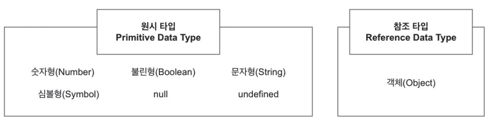

# Part1
## 005.값(value)과 변수(variable)이해하기

* 선언 키워드

  * 프로그래밍할 때 값의 유형을 일일이 명시하지 않으면, 런타임 시 변수의 값에 의해 동적으로 유형이 결정된다. 이를 **동적 바인딩**(Dynamic Binding)이라고 한다.

* 변수명

  * 변수를 선언할 때 선언 키워드 다음에 변수명을 작성한다

    * ex)

      ```javascript
      var name = "Peter"
      ```

  * 키워드를 변수명으로 선언한다면 에러가 발생한다.

    * 자바스크립트 키워드(Keyword)의 종류

      ```javascript
      break case catch class const continue debugger default delete do else export extends finally for function if import in instanceof let new return super switch this throw try typeof var void while with yield
      ```

      

  * 등호 (=)
    * 등호를 사이에 두고 왼쪽에 변수명과 오른쪽에 값을 작성한다.
    * 변수명이 정의된 변수 메모리에 값을 대입한다는 의미이다.


## 006.자바스크립트 문장 배우기

자바스크립트를 구성하는 가장 작은 기본단위는 **값, 변수, 연산자, 키워드**이다.

그리고 이 작은 요소들이 모여 하나의 자바스크립트 문장을 구성한다.

### 표현식(Expressions)과 명령문(Statements)

자바스크립트 코드의 구문 패턴을 살펴보면 표현식과 명령문, 두 종류로 나눌 수 있다.

#### 표현식

표현식은 값을 생성한다. 연산자를 통해 값을 생성하거나, 변수 또는 함수 인자로 값을 넣을 때 표현식을 사용한다.

```javascript
(3 + 12) / 5
declaredVariable
greeting("Hello")
```

#### 명령문

명령문은 일종의 행동 또는 행위를 수행하게 하는 코드이다.

**if, if-else, for, switch** 등이 있다.


## 008.자료형 이해하기

프로그래밍 언어는 값을 특정 유형으로 분류한다.

특정 유형을 다른말로 **자료형** 또는 **타입(type)**이라고 한다.

```javascript
var x = 5; // 숫자형(Number)
var y = 'five'; // 문자형(String)
var isTrue = true; // 불린형(Boolean)
var empty = null; // null
var nothing // undefined
var sym = Symbol('me'); // Symbol

var item = {
	price: 5000,
	count: 10
}; // 객체(Object)
var fruits = ['apple', 'orange', 'kiwi']; // 배열(Array)
var addFruit = function (fruit) {
	fruits.push(fruit);
} // 함수(function)
addFruit('watermelon');
console.log(fruits);
```

자바스크립트는 크게 **원시타입**(Primitive Data Type)과 **참조타입**(Reference Data Type)으로 나뉜다.



### 원시타입

원시타입은 값이 변수에 할당될 때 메모리 상에 고정된 크기로 저장된다. 즉, 해당 변수가 직접 값을 보관한다.

이렇듯 고정된 공간에 보관된 원시 타입의 값은 변경 불가능한 값, 불변값(Immutable Value)인 특징을 가진다.

ex)

* 숫자형(Number)

  숫자를 표현하는 자료형이다. 숫자안에서도 정수, 실수 등 여러 종류로 구분하지만, 자바스크립트의 숫자 자료형은 그 종류들을 숫자형 하나로 포괄한다. 숫자형끼리 연산이 가능하다.

* 불린형(Boolean)

  참(true) 또는 거짓 (false) 두 가지 값을 가진다.

* 문자형(String)

  작은따옴표 '' 또는 큰따옴표""를 양 끝에 두고, 그 안에 한 글자 이상의 문자, 기호 또는 숫자가 있는 자료형

* 심볼형(Symbol)

  ES6부터 추가된 원시 자료형이다. 다른 원시형과 다르게 유일하게 변경 불가능한 자료형으로, 참조형의 키(key)로도 사용 가능하다.

* null

  빈값

* undefined

  존재하지 않는 값

### 참조타입

참조타입은 원시타입과 달리 변수에 고정된 크기를 저장하지 않고, 값의 메모리 주소를 참조한다.

참조 타입인 객체의 특징은

객체는 속성들(Properties)의 집합을 의미하며, 집합 내부에는 순서도 크기도 고정되어있지 않다.

이렇게 고정되지 않은 값을 변수에 할당하려면 직접 해당 값을 저장할 순 없으나 참조하는 것은 가능하다. 따라서 참조타입은 값의 메모리 주소를 변수에 할당하여 값을 참조한다.

* 객체

  객체는 {} 안에 **키:값** 형태로 이루어진 속성들의 모음이다.

  키는 반드시 문자(String) 자료형이어야 하고, 이 속성 키를 통해 해당 속성에 매핑된 값에 접근할 수 있다.

자바스크립트에는 특성에 따라 여러 형태의 객체들이 있다.

Global Object 객체는 모든 객체의 부모가 되는 객체이다. 이를 부모삼아 함수(Function), 배열(Array), 원시 자료형을 객체로 감싼 새로운 형태의 객체(String, Number, Boolean)와 특수 연산에 특화된 내장 객체(Math, JSON, RegEx) 그리고 Iterable과 Collection 특성의 객체(Map, Set, WeakMap, WeakSet) 등의 **표준 내장 객체**가 있다.

## 009.콘솔로 자료형 출력하기

console.log(출력할 내용)

log 메소드 외 활용할 수 있는 다른 console 메소드들

* debug(디버그-로그)
* error(에러)
* info(정보)
* warn(경고)

## 010.조건문 배우기 - if

if문 기본 사용법

```
if (표현식)
	명령문
```


여러가지 if문 사용법 예시

```javascript
var result = true;
if (result) console.log('result 가 참 입니다.');
if (!result)
  console.log('실행되지 않습니다.');
if (result) {
  console.log('result 의 결과');
  console.log('>> 참 입니다.');
}
```

## 011.조건문 배우기 - if, else if, else

else if와 else는 if의 결과값이 false일 때 추가 실행되는 조건문이다.

else if, else 기본 사용법

```
if (표현식1) {
	명령문1
} else if (표현식2) {
	명령문2
} else {
	명령문3
}
```


else if, else문 사용법 예시

```javascript
var number = 2;
if (number == 1) {
  console.log('number 는 1 입니다');
} else if (number == 2) {
  console.log('number 는 2 입니다');
} else if (number == 3) {
  console.log('number 는 3 입니다');
} else {
  console.log('number 는 1,2,3 중 해당되는 것이 없습니다.');
}
```

## 012.조건문 배우기 - switch

switch문장 기본 사용법

```javascript
switch(표현식){
	case 값1:
		명령문1
		break;
	case 값2:
		명령문2
		break;
	default:
		명령문3
}
```

먼저 switch 표현식의 값을 확인하고 case의 값과 일치 여부를 확인한다. 이 때 === 일치 연산자를 사용한다.

case의 값과 표현식이 일치했을 경우 해당 명령문을 실행한다.

여러 case가 있을 경우 위에서부터 순차적으로 일치한 값이 나올 때까지 case값을 확인하며 내려간다.

break는 그 다음의 코드들을 더이상 실행하지 않고 switch 조건문을 끝내는 역할을 수행한다.

만약 일치하는 case값이 없는 경우 마지막 default로 선언된 명령문이 실행된다.

switch 문장 사용법 예시

```javascript
var subject = '자바스크립트';
switch (subject) {
  case 'C언어':
    console.log('초보자를 위한 C++ 200제');
    break;
  case '자바스크립트':
    console.log('초보자를 위한 자바스크립트 200제');
    break;
  case '파이썬':
    console.log('초보자를 위한 파이썬 200제');
    break;
  default:
    console.log('이젠 초보자가 아닙니다');
    break;
}

```

## 013.반복문 배우기 - for

for 반복문은 특정 코드를 반복하는 흐름을 제어한다.

반복문을 통해 언제부터 어디까지 실행할지, 그리고 몇 번을 반복할지도 설정할 수 있다.

반복문 기본 사용법

```
for (초기값; 조건식; 어떤 간격으로) {
	실행할 문장
}
```

반복문 사용 예시

```javascript
for (var i = 0; i < 10; i++) {
	console.log(i + '번째 반복 문장 입니다.');
}
```

다양한 반복문 사용 예시

```javascript
var hometown = [
	{name: '남준', place: '일산', city: '고양'},
	{name: '진', place: '과천'},
	{name: '호석', place: '광주', city: '전라도'},
	{name: '지민', place: '부산', city: '경상도'}
];

for (var i = 0; i < hometown.length; i++) {
	var h = hometown[i];
    // 배열에서 가져온 요소의 정보가 없는 경우, continue를 통해 다음 순서(요소)로 넘어가게 된다.
	if (!h || !h.city) continue;

	console.log(i + ' 번째 실행입니다.');
	
	if (h.name === '호석') {
		console.log(h.name + '의 고향은 ' + h.city + ' ' + h.place + ' 입니다.');
		break;
	}
}
```

for 문에는 break와 continue를 통해 반복문의 흐름을 제어할 수 있다.

continue는 지시자가 놓인 지점 다음의 문장들은 무시되고 다음 반복으로 넘어가게 한다.

break는 break가 있는 지점까지만 실행되고 반복문을 종료한다.

## 014.반복문 배우기 - for in

for in 반복문은 in 키워드를 사이에 두고 오른쪽에는 반복할 대상 변수를, 왼쪽에는 속성명을 작성한다.

```
for (속성명 in 반복할 대상) {
	
}
```

반복문을 통해 내부 요소를 하나씩 순회할 때마다, 각 요소의 키(Key)정보가 for in에서 정의한 속성명으로 선언과 동시에 할당된다.

for in 사용 예시

```javascript
var store = { snack: 1000, flower: 5000, beverage: 2000 };

for (var item in store) {
  if (!store.hasOwnProperty(item)) continue;

  console.log(item + ' 는 가격이 ' + store[item] + ' 입니다.')
}
```

매 반복마다 hasOwnProperty를 이용하여 store객체에 item 키 정보가 있는지 확인하고, 없으면 continue를 통해 아래 코드는 실행하지 않고 다음 순서로 넘어간다.

## 015.반복문 배우기 - while

while 반복문은 지시어 while로 시작한다. 그 다음 소괄호 () 안에 조건식이 들어가는데, 이 조건식의 결과값은 true 또는 false만 가능하다.

조건식이 true를 만족하는 경우에만 중괄호 {} 안의 문장들이 실행된다.

조건식이 false가 되면 더이상 반복 실행하지 않는다.

while 반복문에서도 break와 continue문을 사용할 수 있다.

while문 사용법

```
while (조건식) {
	반복하게 될 문장
}
```

do-while 반복문은 처음은 조건 결과와 상관없이 무조건 문장을 실행(do)한다.

그리고 조건식의 결과값을 확인하고 다음의 흐름은 이전 while문고 ㅏ동일하다.

do-while문 사용법

```
do {
	반복하게 될 문장
}  while (조건식)
```

while문 활용 예시

```javascript
var hometown = [
	{name: '진', city: '과천'},
	{name: '남준', place: '일산', city: '고양'},
	{name: '호석', place: '광주', city: '전라도'},
	{name: '지민', place: '부산', city: '경상도'}
];

// 인자값을 h와 name으로 받는 함수 isHometown을 선언한다.
var isHometown = function(h, name) {
	console.log(`함수가 실행되었습니다. ${h.city} 도시에서 ${name} 을 찾습니다.`);
	// 객체인 h의 name과 인자로 받은 name이 같은경우 console.log를 출력하고 true를 반환한다.
	if (h.name === name) {
		console.log(`${h.name} 의 고향은 ${h.city} ${h.place} 입니다.`);
		return true;
	}	
    // 객체인 h의 name과 인자로 받은 name이 다른경우 false를 반환하며 함수를 종료시킨다.
	return false;
}

var h;

// h변수에 hometown.shift()로 반환된 값을 할당하는 것과 동시에 할당된 값을 확인한다.
// hometown의 요소는 객체로 채워져 있어 값이 유효한 경우 true, 유효하지 않으면 false를 반환하고 이를 통해 반복문을 실행한다.
while (h = hometown.shift()) {
    // 변수 h에 할당된 객체의 name, place, city 속성들 중에 하나라도 없는 경우 continue문을 통해 바로 반복문의 다음 순서로 넘어간다.
    // 모두 있다면 아래 문장들이 실행되고 반복문의 다음 순서로 넘어간다.
	if (!h.name || !h.place || !h.city) continue;
	// isHometown함수에 h변수와 '호석'값을 넣어 결과를 반환받는다.
	var result = isHometown(h, '호석');
    // result값이 true이면 break문을 통해 while반복문을 종료시킨다.
	if (result) break;
}

var i = 0;
var names = ['남준', '정국', '윤기', '호섭'];
var cities = ['경기', '부산', '대구', '광주'];
do {
	hometown[i] = {name: names[i], city: cities[i]};
	i++;
} while (i < 4);

console.log(hometown);
```

shift()는 배열의 앞에서부터 값을 하나씩 뺴내오는 함수이다.
예를 들어, [1, 2]배열에 shift()가 실행되어 1이 방출되면, 해당 배열은 [2]가 된다.
