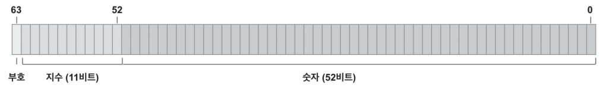

# Part2
## 016. 숫자형 이해하기

* 숫자형(Number)

  * 숫자 형태를 가진 데이터

  * ```
    3
    5.0
    2.789e5
    ```

자바스크립트는 정수, 부동 소수점, 작은 수, 큰 수 등 여러 유형의 숫자를 **숫자형(Number)** 하나로 정의한다.

자바스크립트의 숫자형은 64-bit Floating Point이다.

국제 IEEE 754 표준에 따라 정의된 방식으로, 숫자값을 64비트 정보로 저장한다.

숫자는 비트 0~51에 저장되고, 지수는 비트 52~62, 부호는 비트 63에 저장된다.

다음은 64비트 부동 소수점 형태 그림이다.



For example, if you express the number 13 in Javascript, Computers convert numbers into bits and store them in memory.

In addition, Javascript has Infinity and NaN values.

It is classified as a number type, but, it plays a slightly different role from ordinary numbers.

* Infinity

  Infinity means the biggest number than any other number.

* NaN

  NaN means Not a number, which is a value that cannot be expressed because the result of the arithmetic operation is invalid or the number is too large.

In the console log, Infinity is output as it is.

Infinity로 나누면 무슨 값이든 0이 된다.
유효하지 않는 수식인 경우 연산의 결과 NaN이 된다.

## 017. 문자형 이해하기

* 문자형(String)
  * 값이 텍스트 형태인 데이터

문자열로 표현할 때는 큰따옴표("), 작은 따옴표('), 억음 부호(`)와 함게 사용한다.

자바스크립트는 큰따옴표 문자열과 작은 따옴표 문자열 간의 차이점은 없다.

문자열 내에 \n을 입력 시 개행이 가능함.

## 018. 불린형 이해하기

* 불린형(Boolean)
  * 참(True)과 거짓(False)으로 이루어진 자료형

ex)

```
console.log(7>3);
console.log(3>7);
```

결과

```
true
false
```

## 019. null과 undefined 이해하기

* null
  * null은 **비어있는**, **존재하지 않는 값**을 의미함.
  * 원시자료형 null로 분류된다.
* undefined
  * 변수가 정의되었지만, **아무 값도 할당받지 않은 상태**
  * 함수에서 명시적으로 값을 반환하지 않았을 때 또는 변수에 어떠한 값도 대입하지 안휴고 정의했을 떄 undefined가 반환된다.
  * 원시자료형 undefined로 분류된다.

* null과 undefined 일치비교
  * 동등연산자 `==`인 경우에는 자료형 비교까지 이루어지지 않기 때문에 true를 반환함.
  * 엄격한 일치 연산자 `===`로 확인하면, null과 undefined의 자료형이 다르기 때문에 false를 반환함.


## 020. 템플릿 문자열 이해하기

* ` (억음 부호)
  * 템플릿 문자열은 `(억음부호)로 작성한다.
  * 템플릿 문자열을 이용하면 ${표현식}을 이용하여 interpolation이 가능하다.
    * interpolation : 표현식의 계산된 결과가 문자열로 변경되어 해당 위치에 삽입되는 것

